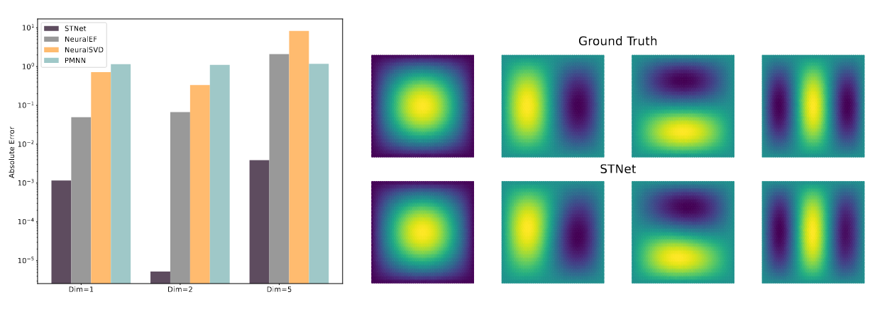
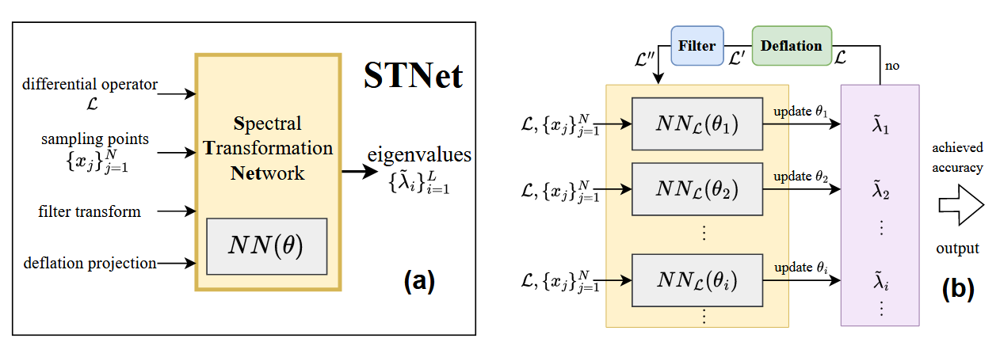

# STNet: Spectral Transformation Network for Operator Eigenvalue Problems

STNet is a learning-based approach for computing eigenvalues and eigenfunctions of linear operators. It trains a neural network under spectral transformations so that target eigenpairs become easier to learn, enabling stable multi-eigenpair training in one run.

> 

---

## Highlights

- Deflation projection: remove already-learned eigensubspaces to avoid mode collapse and stabilize subsequent eigenpairs.
- Filter transform: reshape the spectrum (amplify a target interval, suppress outside) to improve convergence and accuracy.
- End-to-end multi-eigenpair learning: obtain several eigenpairs in one training process.
- Benchmarks covered: Harmonic, Schrödinger Oscillator, Fokker–Planck.

---

## Method

Let $L $ be a linear operator and $v_i $ the i-th eigenfunction. STNet represents $v_i$ with an MLP and applies two transforms each iteration:

1) Deflation: $D_i(L) = L − Q_{i−1} Σ_{i−1} Q_{i−1}^T$, where $Q_{i−1} = [ṽ_1, …, ṽ_{i−1}]$ and $Σ_{i−1} = diag(λ̃_1, …, λ̃_{i−1})$, to remove the span of learned eigenfunctions.
2) Filter: $F_i(L) = ∏_{j=1}^{i−1} [(L − (\tilde{\lambda}_j − ξ) I)(L − (\tilde{\lambda}_j + ξ) I)]$, which enlarges spectral gaps near target eigenvalues.

A residual-style loss encourages $v_i$ to match the action of the transformed operator without explicit inverses.

---

## Environment

- Python ≥ 3.9
- PyTorch
- CPU or CUDA GPU

---

## Quick Start

From repo root:

    # 2D Harmonic on GPU
    python train.py --d 2 --problem_type Harmonic --device cuda
    
    # 2D Harmonic on CPU
    python train.py --d 2 --problem_type Harmonic --device cpu

Other problems:

    # Schrödinger Oscillator
    python train.py --d 2 --problem_type Oscillator --device cuda
    
    # Fokker–Planck (named Planck)
    python train.py --d 2 --problem_type Planck --device cuda

Common args:

- --d : problem dimension (e.g., 1/2/5)
- --problem_type : Harmonic | Oscillator | Planck
- --device : cpu | cuda

---------

## Loss Curves & Visualization

    # Plot training loss curves
    python plot_loss.py
    
    # Visualize learned eigenfunctions
    python predict.py

---

## Citation

